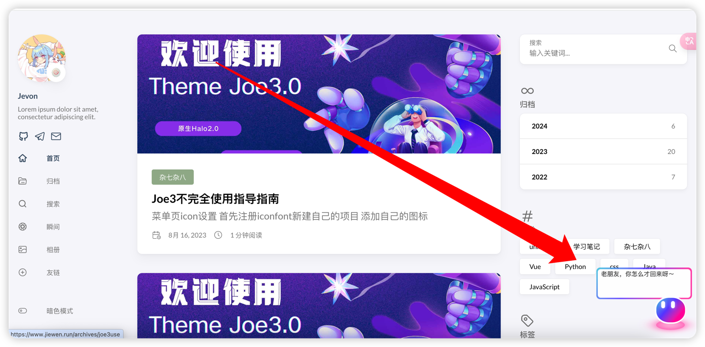

## aurora-dia

一个从 [hexo-theme-aurora](https://github.com/auroral-ui/hexo-theme-aurora) 提出来的小工具，觉得蛮好看的。  
  


## 使用方法

使用的lit编写，只需要将生成的js文件引入即可。

```html
<script>
  const auroraDia = document.createElement('aurora-dia');
  //放置位置，支持left和right
  auroraDia.setAttribute('position', 'right');
  //语言，支持zh-CN、zh-TW、en
  auroraDia.setAttribute('locale', 'zh-CN');
  document.body.appendChild(auroraDia);
</script>
<script type="module" crossorigin defer src="/upload/index-D5jTOrmf.js"></script>
```

当然，我现在并没有给出在线地址和打包好的文件，所以你需要自己打包。

```bash
git clone repo
cd repo
bun install
bun build
```

## TODO

- [ ] 优化代码（现在很乱，别问为什么，问就是懒，直接抄）
- [ ] 优化功能和配置 （现在跟原版比还是少了一些功能和配置，比如鼠标滑到归档、标签应该有配置，后续再说）

### 同时也欢迎大家提出建议和pr。

最后，非常感谢原作者的开源，[hexo-theme-aurora](https://github.com/auroral-ui/hexo-theme-aurora)
